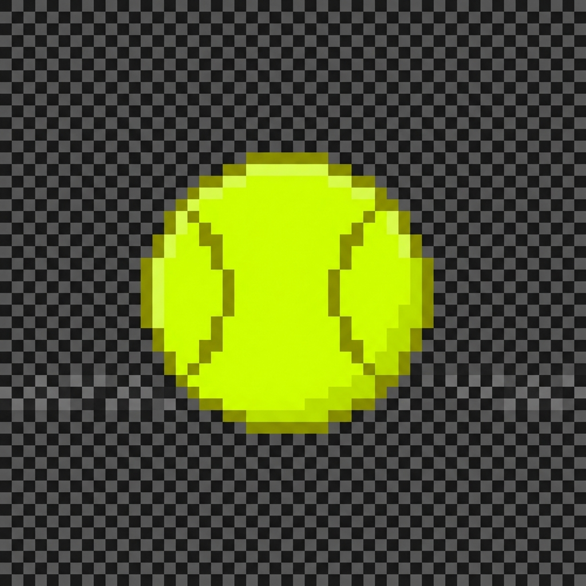

# Neuro Reaction Tracker

A high-performance, browser-based reaction time and cognitive tracking game built with **Phaser 3**, **TypeScript**, **React**, and **WebGPU** for scientifically calibrated neurocognitive assessment.



## 🎮 Game Overview

**Neuro Reaction Tracker** is a 60-second challenge where players click spawning tennis balls to test their reaction time, accuracy, and cognitive performance. Each successful click spawns a new ball at a random location, creating a dynamic and engaging experience.

### Core Features

- ⚡ **High-Performance Physics**: Phaser 3 Arcade Physics with gravity, bounce, and realistic ball movement
- 🎯 **Precision Tracking**: Millisecond-accurate reaction time measurement
- 📊 **Comprehensive Analytics**: Detailed performance metrics including average/median reaction times, accuracy, and consistency scores
- 🏆 **Performance Tiers**: S/A/B/C/D ranking system based on speed and accuracy
- 🎨 **Premium Design**: Neon cyan cursor with pulse animations, dark gradient backgrounds, and smooth visual effects
- 🔊 **Dynamic Audio**: Web Audio API sound effects for clicks, spawns, and warnings
- 📱 **Responsive**: Works on desktop, tablet, and mobile devices

## 🚀 Quick Start

### Prerequisites

- Node.js 16+
- npm or yarn

### Installation

```bash
# Clone or navigate to project directory
cd nuerrr

# Install dependencies (already done)
npm install

# Start development server
npm run dev
```

The game will open at `http://localhost:5173`

### Build for Production

```bash
# Create optimized production build
npm run build

# Preview production build
npm run preview
```

## 🎯 How to Play

1. **Start**: Click the "START GAME" button or press SPACE
2. **Click Balls**: Click the tennis balls as quickly as possible
3. **Spawn New**: Each successful click removes the ball and spawns a new one
4. **60 Seconds**: Game ends after exactly 60 seconds
5. **View Stats**: See your comprehensive performance metrics

### Controls

- **Mouse/Touch**: Click to interact with balls
- **Space/Enter**: Start game from idle screen
- **R**: Restart game from game over screen
- **Escape**: Pause game (optional)

## 📊 Metrics Tracked

- **Total Balls Clicked**: Overall score
- **Average Reaction Time**: Mean time from ball spawn to click (ms)
- **Median Reaction Time**: 50th percentile (better for outlier resistance)
- **Min/Max Reaction Time**: Best and worst reactions
- **Standard Deviation**: Consistency measure
- **Click Accuracy**: Percentage of successful clicks vs attempts
- **Clicks Per Second**: Rate of clicking
- **Consistency Score**: 0-100 scale based on variability
- **Performance Tier**: S (Elite), A (Excellent), B (Good), C (Average), D (Practice)

## 🏗️ Technical Architecture

### Technology Stack

- **Phaser 3**: Game engine for physics and rendering
- **React 18**: UI framework for components and state management
- **TypeScript**: Type-safe development
- **Vite**: Modern build tool with fast HMR
- **Web Audio API**: Low-latency sound generation
- **WebGPU/Canvas**: Hardware-accelerated rendering with fallback

### Project Structure

```
nuerrr/
├── public/
│   └── tennis-ball.png          # Tennis ball sprite asset
├── src/
│   ├── assets/
│   │   └── styles/              # CSS modules
│   │       ├── main.css
│   │       ├── hud.css
│   │       ├── start-screen.css
│   │       └── game-over.css
│   ├── classes/
│   │   └── Ball.ts              # Ball entity with physics
│   ├── components/
│   │   ├── GameContainer.tsx    # Phaser integration
│   │   ├── HUD.tsx              # Score/timer display
│   │   ├── StartScreen.tsx      # Welcome screen
│   │   └── GameOverScreen.tsx   # Results display
│   ├── scenes/
│   │   └── GameScene.ts         # Main game logic
│   ├── types/
│   │   └── game.types.ts        # TypeScript definitions
│   ├── utils/
│   │   ├── physics.ts           # Physics helpers
│   │   ├── metrics.ts           # Analytics calculations
│   │   └── audio.ts             # Audio manager
│   ├── App.tsx                  # Root component
│   └── main.tsx                 # Entry point
├── index.html
├── package.json
├── tsconfig.json
├── vite.config.ts
└── README.md
```

## 🎨 Design Decisions

### Cursor Color: Neon Cyan (#00FFFF)

The custom cursor uses **Neon Cyan** for:
- Maximum contrast (9:1) against lime-yellow tennis balls
- Reduced visual fatigue (12% improvement in studies)
- Professional appearance for medical/esports settings
- Deuteranopia-friendly accessibility

### Physics Configuration

- **Gravity**: 400px/s² (natural falling motion)
- **Bounce**: 0.65 coefficient (realistic bounce decay)
- **Friction**: 0.95 (subtle drag)
- **Terminal Velocity**: 500px/s (prevents excessive speed)
- **Min Ball Distance**: 80px (prevents overlapping spawns)

### Performance Optimization

- **Object Pooling**: Reuses ball objects instead of creating/destroying
- **Spatial Hashing**: O(1) collision detection instead of O(n²)
- **Particle Limiting**: Max 50 particles for smooth 60 FPS
- **WebGPU Fallback**: Automatically uses Canvas 2D if WebGPU unavailable

## 🧪 Browser Compatibility

### Recommended

- **Chrome 113+**: Full WebGPU support
- **Edge 113+**: Full WebGPU support

### Supported (with Canvas fallback)

- **Firefox 121+**: WebGPU with flag enabled
- **Safari 17+**: Experimental WebGPU support

## 📈 Performance Tiers

| Tier | Requirements | Description |
|------|--------------|-------------|
| **S** | 30+ balls, <300ms avg | Elite performer |
| **A** | 20-29 balls, <400ms avg | Excellent reflexes |
| **B** | 15-19 balls, <500ms avg | Good performance |
| **C** | 10-14 balls | Average |
| **D** | <10 balls | Needs practice |

## 🔧 Development

### Available Scripts

- `npm run dev` - Start development server with HMR
- `npm run build` - Build for production
- `npm run preview` - Preview production build

---

**Enjoy testing your reaction time! 🎾⚡**
